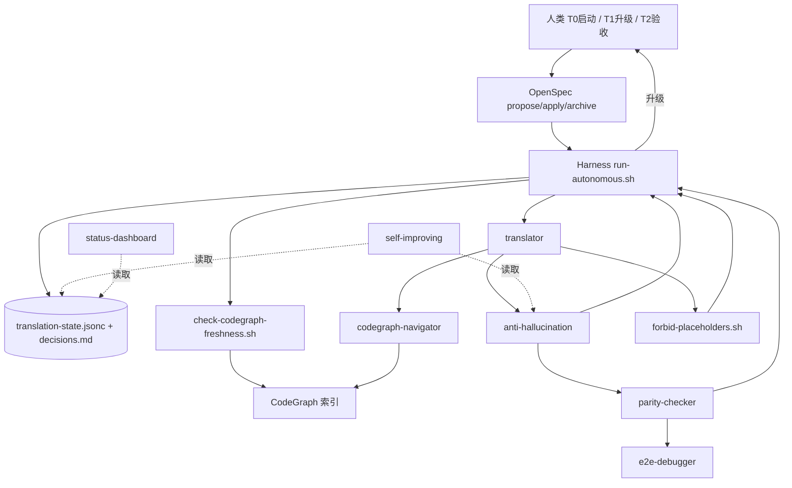

# Transpilot — 端到端源码翻译工具链

将 Go/C 项目系统化翻译为惯用 Rust 代码的完整工具链。

## 特性

- **Go→Rust 翻译** — 类型映射、并发模式、错误处理、序列化兼容
- **C→Rust 翻译** — 内存安全、指针消除、预处理器映射、FFI 互操作、unsafe 审计
- **四层等价性验证** — 结构/功能/接口/行为 四层验证确保翻译正确性
- **幻觉防御网** — anti-hallucination skill + 5 问检查清单 + 索引新鲜度校验
- **Wave 模式翻译** — 分批翻译，每批 3-5 模块，逐步推进
- **自我改进系统** — 从翻译经验中自动积累模式
- **E2E 诊断器** — 自动定位翻译引入的行为差异
- **进度仪表盘** — 实时跟踪翻译进展

## 全局架构



Skill 间数据流契约见 [.agents/skills/shared/interfaces.md](.agents/skills/shared/interfaces.md)。

## 从 Taibai 提炼

本工具链的核心经验来自 Taibai 项目（Kubernetes v1.36 Go→Rust 翻译）：
- 30+ 翻译决策
- 8 个关键教训
- 2459 个测试验证的翻译方法论
- 99.5% parity 目标的实战经验

## 快速开始

### 1. 初始化翻译项目

```bash
# Go 项目
./scripts/init-project.sh my-project go /path/to/go/source /path/to/rust/target

# C 项目
./scripts/init-project.sh my-project c /path/to/c/source /path/to/rust/target
```

### 2. 开始翻译

在 IDE 中打开目标项目，Agent 会自动加载相关技能：
- 读取 `translation-state.jsonc` 恢复状态
- 按 Wave 模式逐批翻译
- 自动验证等价性

### 3. 查看进度

```bash
./scripts/parity-report.sh summary
./scripts/parity-report.sh risk
```

## 目录结构

```
transpilot/
├── .agents/skills/
│   ├── go2rust/          # Go→Rust 翻译技能（5 个文件）
│   ├── c2rust/           # C→Rust 翻译技能（6 个文件）
│   ├── shared/           # 共享翻译方法论（5 个文件）
│   ├── translator/       # 统一翻译驱动器
│   ├── parity-checker/   # 等价性验证器
│   ├── e2e-debugger/     # E2E 诊断器
│   ├── status-dashboard/ # 进度仪表盘
│   └── self-improving/   # 自我改进系统
├── config/               # Agent 配置
├── templates/            # 项目模板
├── scripts/              # 初始化/报告脚本
├── docs/                 # 文档
└── examples/             # 示例
```

## 核心概念

### Wave 模式
每次翻译 3-5 个互不依赖的模块，完成后运行 E2E 验证。
通过不开始下一 Wave。

### 叶子优先
先翻译没有项目内依赖的模块（叶子节点），逐步向核心推进。

### 四层等价性
1. **结构等价** — API 表面一致
2. **功能等价** — 单元测试通过
3. **接口等价** — 模块间交互正确
4. **行为等价** — 端到端行为一致

### 三支柱治理
1. `translation-state.jsonc` — 进度跟踪
2. `decisions.md` — 决策记录
3. 技能文件 — 翻译知识库

## 六大反模式

| 反模式 | 表现 | 预防 |
|--------|------|------|
| Green CI Trap | CI 绿但行为错误 | 四层验证 |
| Late E2E | 太晚才做 E2E | 第一模块后立即 E2E |
| Stub Accumulation | 只有 Mock 没有 Real | DI 验证规则 |
| Copy-Shape-Not-Behavior | 形似但行为不同 | 行为测试优先 |
| Blind Retry | 盲目重试不分析 | 根因分析优先 |
| Probe-Before-Implement | 未理解就实现 | 先读源码再翻译 |

## License

MIT
